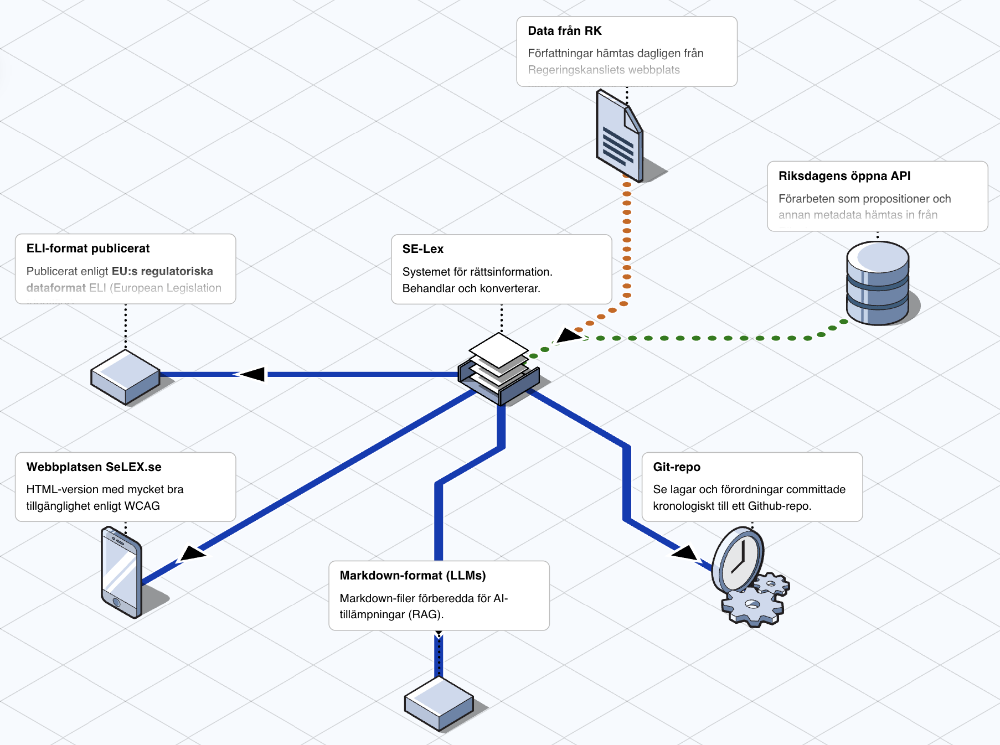

# SE-Lex

SE-Lex är en svensk rättsdatabas, med fokus på författningar vilket är **Sveriges lagar, förordningar och föreskrifter**. Den baserar sig på offentliga handlingar.

**[📗 Svensk författningssamling (SFS) som Git-repo](https://github.com/se-lex/sfs)**

## 🎯 Målsättningar

Projektet eftersträvar:

- att vara en bra källa att inhämta rättsinformation för vektorisering och nyttjande i AI-tillämpningar.

- att påverka och föreslå hur regelgivningsprocessen och lagstiftningsprocessen kan reformeras inom staten, med textfil som grundformat (företrädesvis Markdown), Git som versionshantering och "Pull Requests"-upplägg för remissrundor.

- att uppfylla [kvalitetskrav](https://rattsinfo.se/kvalitetskrav/) för rättsdatabas, definierade av [Stiftelsen för rättsinformation](https://rattsinfo.se).

## 🫶 Bakgrund och motiv

Våra nordiska grannländer har en bättre hantering av rättsinformation, medan det i Sverige just nu mest är PDF-filer publicerade på myndigheternas webbplatser. Sverige förtjänar något bättre.

Domstolsverket har lämnat in en [slutrapport](https://www.domstol.se/nyheter/2025/05/alternativa-vagar-framat-for-en-saker-och-effektiv-tillgang-till-rattsinformation--redovisning-av-regeringsuppdrag/) på [deras regeringsuppdrag](https://www.regeringen.se/pressmeddelanden/2023/12/uppdrag-om-en-saker-och-effektiv-tillgang-till-rattsinformation/) kring att göra något åt saken.

Vi har kännedom om ett flertal AI-initiativ har behov av materialet.

## Våra val

### 📝 Markdown som digitalt format

Vi har valt Markdown som det primära digitala formatet för att lagra rättsinformation av flera anledningar:

- **Läsbarhet**: Markdown är läsbart både som källkod och i renderad form, vilket gör det tillgängligt för både människor och maskiner.
- **AI-vänligt**: Markdown är ett idealiskt format för AI-tillämpningar och kan enkelt processas för vektorisering och sökning.
- **Strukturerat**: Markdown tillåter tydlig strukturering av juridiska dokument med rubriker, listor, tabeller och länkar.
- **Versionshanterat**: Textfiler fungerar optimalt med versionshantering och gör det enkelt att spåra ändringar över tid.
- **Öppet**: Markdown är ett öppet format utan leverantörsberoenden eller licensavgifter.
- **Hållbarhet**: Som ett textbaserat format är Markdown plattformsoberoende och kommer att vara läsbart även om specifika verktyg försvinner.

### 🌿 Git som versionshantering

Git används som versionshanteringssystem för att spåra alla ändringar i rättsdatabasen:

- **Fullständig historik**: Varje ändring i lagtext dokumenteras med tidsstämpel, anledning och beskrivning.
- **Transparens**: Alla ändringar är öppna och spårbara, vilket skapar transparens i regelgivningsprocessen.
- **Distribuerat**: Varje kopia av repositoriet innehåller hela historiken, vilket skapar redundans.
- **Branching**: Möjliggör parallell utveckling av olika lagförslag och remissversioner.
- **Sammanfoga-funktionalitet**: Strukturerat sätt att sammanföra ändringar från olika källor.
- **Integrationer**: Git integreras väl med CI/CD-verktyg för automatisk publicering av olika format.
- **Standardverktyg**: Git är branschstandard och välkänt bland utvecklare, vilket underlättar bidrag och underhåll.

## 🔗 Datakällor

Datan hämtas från [Regeringskansliets söktjänst](https://beta.rkrattsbaser.gov.se), [Riksdagens öppna API](https://www.riksdagen.se/sv/dokument-och-lagar/riksdagens-oppna-data/) och myndigheters webbplatser.

## 📦 Artefakter

### Git-repo

[📗 Svensk författningssamling (SFS) som Git-repo](https://github.com/se-lex/sfs)

SFS som Git-historik, där varje ändring återfinns i en commit. Styrkan är att man ser varje differens tydligt och hur varje dokument förändrats över tid.

Tyvärr hanterar inte Git tidsstämplar tidigare än 1980, därför har alla lagar och förordningar tidigare än så fått 1980 som commit date.

### Webbversion

Publicering av HTML-version sker på [selex.se](https://selex.se), med länkar till andra format. Webbplatsen stödjer [ELI](https://eur-lex.europa.eu/eli-register/about.html), den juridiska standard som EU tagit fram för publicerad lagstiftning.

### Markdown med temporala taggar

Förberett för AI-tillämpningar med RAG. Kontakta martin@marca.se för mer information.

## Flödesdiagram

